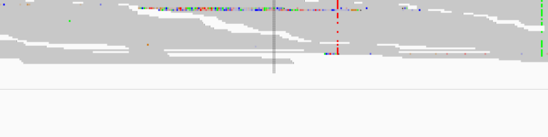

# igvReader: classify mutations as real or false positive
## Description
this is a CNN model to automatically review gene mutation variants. It is pretty much still a work in progress since I did not get a chance to generate enough training images to get the model fully trained. However, all the components needed to train the model have been developed. The model trained with just a few thousand images have an accuracy > 98% for test data set. This demonstrate the model can be very useful when it is fully trained with enough edge cases.

## Model Architecture:
resnet34 pretrained on ImageNet, fined tuned with ~4000 processed igv screenshots

## Core Components:
igv snapshot generator: this automatically generate IGV screen shots for all presumptive SNVs. the input for this is a file listing all variants.
snapshots processor: this crops out portions of an IGV snapshot, which are not informative for the model to judge if it is a true or false variant.
model training: pre-trained model fine tuning using fastai libraries.

## Limitations:
- the model is only trained on limited number of SNV IGV collapsed snapshots. So currently, it only works for SNVs.
It is not clear if it will works well on RNA bams. It is trained on genome bam only, which in general has relatively low coverage <80x. RNA can have thousands of coverages. Random down-sampling step is needed to cut down the coverage to fit into a reasonable sized snapshots.
- For some unknown reason, I found images by manually taking a screenshot on my computer has 4 channels. It is very weird. Unfortunately, I don't have time to figure this out. However, if i use igv batch command, it has 3 channels. when resizing the images, i can not use NEAREST resampling method because this results in loosing information. it seems any other method will keep the centre line. I use BILINEAR INTERPLOATION for now.
- As a result, manually taking a screen shot and cropping out the region of interest to produce a photo is not compatible with the prediction model because of the incompatible channel number, and specific image resampling method. The model is not built for this purpose in the first place. It is designed to automatically taking thousands of screenshots, then processing the images and finally fit into the model for prediction.

## Model Training (see [requirements.txt](requirements.txt)):    
- fastai:  version 1.0.42
- PyTorch:  version  1.0.0
- Python:  version 3.6
- [igvReader notebook](https://github.com/stuartzong/deepreview)

## Model Deployment:    
- Heroku
- Flask:  version 1.0
- web app is [**igvReader.herokuapp.com**](https://igvReader.herokuapp.com)
 
## Demo Image

## Citation:
Pattaniyil, Nidhin and Shaikh, Reshama, [Deploying Deep Learning Models On Web And Mobile](https://reshamas.github.io/deploying-deep-learning-models-on-web-and-mobile/), 2019
